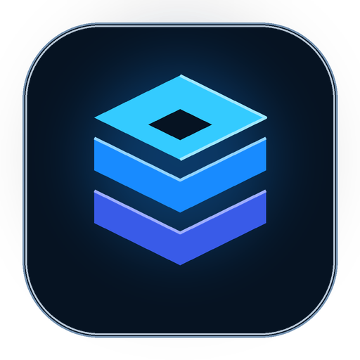

<div align="center">



# MYWO

### Jednostavno. Vaši cjenici. Svugdje.

**Profesionalna Windows aplikacija za centralno upravljanje proizvodima, uslugama, cijenama, objavama i API integracijama.**

[](https://github.com/bren-wp/MYWO/releases/latest)
[](https://dotnet.microsoft.com/)
[](https://github.com/bren-wp/MYWO/releases/tag/v0.9.4)
[](https://github.com/bren-wp/MYWO/actions/workflows/windows-release.yml)

**[Preuzmi Setup](https://github.com/bren-wp/MYWO/releases/download/v0.9.4/MYWO-Setup.exe)** ·
**[Preuzmi Portable](https://github.com/bren-wp/MYWO/releases/download/v0.9.4/MYWO-Portable.exe)** ·
**[Najnoviji release](https://github.com/bren-wp/MYWO/releases/latest)**

</div>

---

## Jedno mjesto za cijeli cjenik

MYWO je desktop radno okruženje za trgovce i pružatelje usluga koji žele održavati strukturirane cjenike bez ručnog dupliciranja podataka. Proizvodi, usluge, kategorije, brendovi, dostupnost, posebni oblici prodaje, sidrene cijene, objave i integracije vode se iz jedne aplikacije.

| Upravljanje | Objavljivanje | Kontrola |
| --- | --- | --- |
| Proizvodi i usluge | XML i CSV | Povijest cijena |
| Kategorije i brendovi | Lokalni REST API | Audit zapis |
| Više tvrtki | Stabilne javne datoteke | SHA-256 provjera |
| Masovne cijene | Automatizirane objave | Backup / restore |

## Windows proizvod, ne web-mockup

MYWO koristi vlastiti tamni vizualni sustav prenesen iz odobrenih referentnih ekrana: kompaktna lijeva navigacija, globalna pretraga, KPI kartice, poslovne tablice, desni editor drawer, statusne oznake i konzistentne akcije. Sve je implementirano stvarnim WPF kontrolama — screenshotovi se ne koriste kao pozadina aplikacije.


Od v0.9.4 sučelje ima **full, compact, narrow i ultra-narrow** način rada uz dodatni short-window režim. Veličina i položaj glavnog prozora pamte se između pokretanja, promjena DPI-ja i rezolucije ponovno pokreće work-area reflow, a CI stvarno resizea pokrenutu aplikaciju kroz više desktop veličina prije objave releasea. Dashboard, Objava, API i Promjene cijena reflowaju KPI kartice na užim prozorima, Administracija se na narrow prikazu slaže vertikalno, a API, Arhiva i Promjene cijena imaju vertikalni fallback umjesto rezanja donjeg sadržaja. Compact sidebar dobiva tooltipove, akcijske trake se prelamaju bez preklapanja, dijalozi poštuju work-area monitora na kojem se stvarno otvaraju, a Per-Monitor V2 DPI awareness održava geometriju pri 125/150/175/200% scalingu. DataGridovi koriste virtualizaciju i automatske scrollbare za velike kataloge.

## Ključne mogućnosti

- **Proizvodi** — šifra, brend, kategorija, JM, cijena/JM, MPC, barkod, dostupnost, posebna prodaja, sidrena cijena, opis i lokalna slika.
- **Usluge** — MPC, kategorija, posebni oblik prodaje, sidrena cijena, bilješke i status.
- **Masovne cijene** — postotak, fiksna promjena ili točna vrijednost; odmah ili zakazano.
- **Povijest i undo** — evidencija cijena i sigurno vraćanje odabrane promjene.
- **Objava** — XML, CSV, kombinirana objava, stabilne datoteke i SHA-256 integritet.
- **API ključevi** — sigurni tokeni, hashirano spremanje, scopeovi, opoziv i statistika.
- **Lokalni API** — localhost-only Kestrel endpointi za tvrtku, kategorije, brendove, proizvode, usluge i katalog.
- **Više tvrtki** — izolacija podataka po `company_id`.
- **Backup / restore** — SQLite backup, provjera baze i sigurniji restore.
- **Notifikacije i automatizacija** — in-app obavijesti i zakazana dnevna objava dok MYWO radi.
- **Portable način** — podaci ostaju u `MYWO-Data` uz portable EXE.
- **Integrirani update i uninstall** — `MYWO-Update.exe` radi update i deinstalaciju; nema zasebnog `uninstall.exe`.

## Preuzimanja

| Paket | Namjena |
| --- | --- |
| **MYWO-Setup.exe** | Per-user Windows instalacija, shortcuti i Installed Apps registracija |
| **MYWO-Portable.exe** | Jedna samostalna EXE datoteka s lokalnim portable podacima |
| **MYWO-Update.exe** | Update i integrirani `--uninstall` |
| **update.json** | Manifest verzije i SHA-256 update payload-a |
| **SHA256SUMS.txt** | Kontrolne sume release artefakata |

Windows release pipeline mora proći **compile, portable runtime smoke test, Setup instalaciju i integrirani uninstall test** prije objave releasea.

## Responsivnost i UI/UX

MYWO nije zaključan na jednu rezoluciju. Filteri koriste proporcionalne stupce, akcije se prelamaju, tablice imaju vlastito skrolanje, editor drawer se adaptira, a dijalozi se automatski ograničavaju na dostupan Windows work area.

- [Responsive UI / UX](docs/RESPONSIVE-UI.md)
- [Pixel parity](docs/PIXEL-PARITY.md)
- [UI implementacija](docs/UI-IMPLEMENTATION.md)

## Sigurnost i privatnost

API ključevi nastaju sigurnim RNG-om i u bazi se čuva samo hash. Lokalni API sluša isključivo na `127.0.0.1`, nema wildcard CORS, detaljne greške ostaju u lokalnom logu, a objave i update paketi koriste SHA-256 provjeru.

## Tehnologija

- .NET 10 / WPF
- SQLite + WAL
- ASP.NET Core Kestrel
- self-contained single-file Windows x64
- GitHub Actions Windows release pipeline
- SHA-256 update i publication provjere

## Build

```powershell
dotnet restore .\MYWO.sln
dotnet build .\MYWO.sln -c Release
.\scripts\build-release.ps1 -Version 0.9.4
```

## Dokumentacija

[Arhitektura](docs/ARCHITECTURE.md) ·
[API](docs/API.md) ·
[CSV](docs/CSV-FORMAT.md) ·
[Cijene i automatizacija](docs/PRICE-AUTOMATION.md) ·
[Windows release](docs/RELEASE.md) ·
[Validacija](docs/VALIDATION.md) ·
[Changelog](CHANGELOG.md)

> XML/CSV format u repozitoriju je MYWO aplikacijski format. Ne predstavlja se kao službeno certificirana regulatorna shema dok takva shema nije mapirana prema važećem službenom izvoru.

---

<div align="center">


**MYWO — jednostavno upravljajte. Brže objavljujte. Ostanite ažurni.**

</div>
